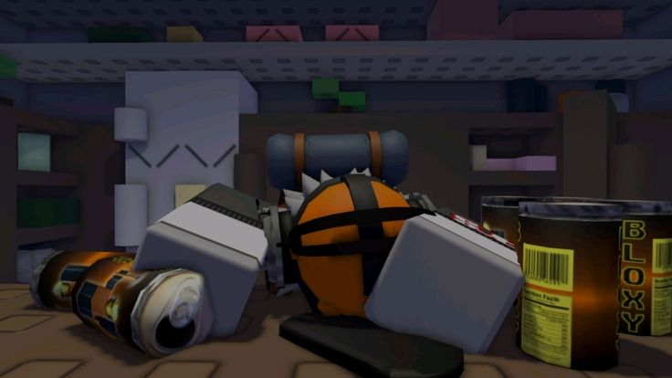

 
   

# OBSERVERMT

### `DEVELOPMENT ARCHIVE`

**Solo Game Developer · Programmer**

`ROBLOX STUDIO`　·　`LUAU`　·　`GAME DEVELOPMENT`

 

 

## 📌 01. ABOUT THE OBSERVER

I'm **ObserverMT** - a programmer and solo game developer focused primarily on **Roblox Studio**, with additional experience in Unity and other development environments.

I have a formal background in **programming** and am continuing my education in **Game Development**. My main specialization is programming, but solo development has led me into many adjacent creative and technical fields.

My work can involve **gameplay programming, system architecture, automation, security, optimization, 3D modeling, environment building, animation, VFX, 2D art, UI, music and audio, narrative development, and technical documentation**.

Programming remains my strongest field. The other disciplines are areas I actively use and continue to develop through practical projects.

> `CURRENT OBJECTIVE | Turn ideas into complete, playable experiences.`

## 🎮 02. SOLO DEVELOPMENT

I primarily work as a **solo developer**, which means taking responsibility for multiple parts of a game's production - from the initial idea and technical foundation to a playable implementation.

Rather than focusing exclusively on code, I work across several areas of development:

- **Programming** - gameplay systems, mechanics, architecture, security, automation and optimization.
- **3D & World Building** - modeling, environment design, map building and scene composition.
- **2D & UI** - artwork, icons, interface elements and visual presentation.
- **Animation & VFX** - character/object animation and visual effects.
- **Music & Audio** - music, sound design and audio implementation.
- **Narrative & Direction** - concepts, story elements, atmosphere and overall project direction.

> `DEVELOPMENT PIPELINE | IDEA → DESIGN → BUILD → TEST → ITERATE → PLAYABLE EXPERIENCE`

## 📊 GitHub Stats & Trophies

  

  

## 🛠️ Languages & Tools

<h3 align="center">Programming Languages</h3>

  &nbsp;&nbsp;&nbsp;&nbsp;&nbsp;&nbsp;&nbsp;
  &nbsp;&nbsp;&nbsp;&nbsp;&nbsp;&nbsp;&nbsp;
  &nbsp;&nbsp;&nbsp;&nbsp;&nbsp;&nbsp;&nbsp;
  &nbsp;&nbsp;&nbsp;&nbsp;&nbsp;&nbsp;&nbsp;
  &nbsp;&nbsp;&nbsp;&nbsp;&nbsp;&nbsp;&nbsp;
  &nbsp;&nbsp;&nbsp;&nbsp;&nbsp;&nbsp;&nbsp;
  &nbsp;&nbsp;&nbsp;&nbsp;&nbsp;&nbsp;&nbsp;
  

<h3 align="center">Frontend</h3>

  &nbsp;&nbsp;&nbsp;&nbsp;&nbsp;&nbsp;&nbsp;
  &nbsp;&nbsp;&nbsp;&nbsp;&nbsp;&nbsp;&nbsp;
  &nbsp;&nbsp;&nbsp;&nbsp;&nbsp;&nbsp;&nbsp;
  &nbsp;&nbsp;&nbsp;&nbsp;&nbsp;&nbsp;&nbsp;
  

<h3 align="center">Backend</h3>

  &nbsp;&nbsp;&nbsp;&nbsp;&nbsp;&nbsp;&nbsp;
  

<h3 align="center">Database</h3>

  &nbsp;&nbsp;&nbsp;&nbsp;&nbsp;&nbsp;&nbsp;
  &nbsp;&nbsp;&nbsp;&nbsp;&nbsp;&nbsp;&nbsp;
  

<h3 align="center">DevOps & Cloud</h3>

  &nbsp;&nbsp;&nbsp;&nbsp;&nbsp;&nbsp;&nbsp;
  

<h3 align="center">Tools</h3>

  &nbsp;&nbsp;&nbsp;&nbsp;&nbsp;&nbsp;&nbsp;
  &nbsp;&nbsp;&nbsp;&nbsp;&nbsp;&nbsp;&nbsp;
  

  

 

## 🔗 Connect with Me

  &nbsp;&nbsp;
  &nbsp;&nbsp;
  &nbsp;&nbsp;
  

## 💬 Quote
> "Observe the world. Understand the system. Build what comes next."

<picture>
  <source media="(prefers-color-scheme: dark)" srcset="https://raw.githubusercontent.com/abozanona/abozanona/output/pacman-contribution-graph-dark.svg">
  <source media="(prefers-color-scheme: light)" srcset="https://raw.githubusercontent.com/abozanona/abozanona/output/pacman-contribution-graph.svg">
  
</picture>

  

